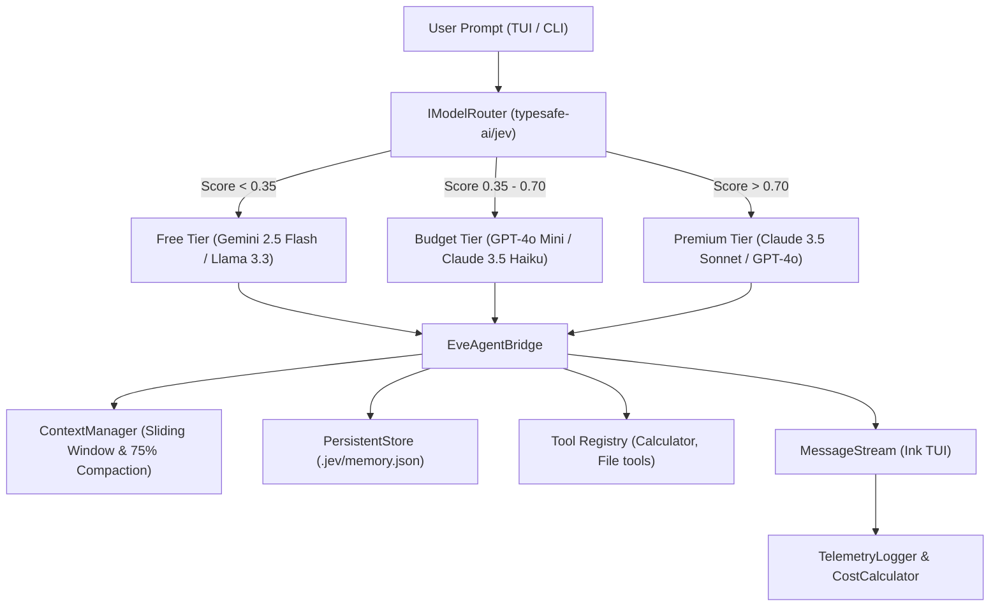

# Jev Router Harness

An AI Terminal User Interface (TUI) harness powered by Vercel's [Eve](https://github.com/vercel) agent foundation and [`typesafe-ai/jev`](https://github.com/typesafe-ai/jev) dynamic model routing.

Jev Router Harness provides a keyboard-driven terminal environment for autonomous AI agents. Every prompt, tool invocation, and reasoning step is evaluated dynamically to select the best free or low-cost model capable of completing the task, escalating to premium tiers only when strictly required by complexity.

---

## Table of Contents

- [Core Capabilities](#core-capabilities)
- [Architecture & Flow](#architecture--flow)
- [Model Routing Tiers](#model-routing-tiers)
- [Prerequisites](#prerequisites)
- [Installation](#installation)
- [Usage Instructions](#usage-instructions)
  - [Interactive Mode](#interactive-mode)
  - [CLI Flags & Options](#cli-flags--options)
  - [One-Shot Prompts & Dry-Run Mode](#one-shot-prompts--dry-run-mode)
- [TUI Navigation & Keybindings](#tui-navigation--keybindings)
- [Slash Commands](#slash-commands)
  - [Context Window Management](#context-window-management)
  - [Persistent Memory](#persistent-memory)
  - [Telemetry & Cost Dashboard](#telemetry--cost-dashboard)
- [Extending Agents & Tools](#extending-agents--tools)
- [Development & Testing](#development--testing)
- [Project Governance](#project-governance)
- [License](#license)

---

## Core Capabilities

- **Intelligent Dynamic Routing**: Evaluates prompt depth, technical vocabulary, and multi-step reasoning demands using `typesafe-ai/jev` with a deterministic heuristic fallback for offline usage.
- **Decoupled Agent Bridge**: Built on Vercel Eve patterns (`EveAgentBridge`) with support for streaming tokens, lifecycle events, tool dispatch, and instantaneous cancellation via `AbortSignal`.
- **Context Compaction**: Sliding-window manager that tracks token consumption and automatically compacts dialogue history when utilization reaches the 75% headroom threshold, preserving conversational continuity.
- **Persistent Local Memory**: Zero-cloud-dependency atomic JSON store (`.jev/memory.json`) using write-temp-fsync-rename semantics for user preferences and project instructions across sessions.
- **Terminal-Native UI**: Ink / React for Terminal interface with ANSI/VT100 styling, responsive window resizing (`useTerminalResize`), status indicators, and modal overlays.
- **Telemetry & Cost Accounting**: Per-turn and cumulative session cost calculation, tracking token volume, response latency, and USD savings compared to an all-premium baseline.
- **100% Offline Resilience**: Runs completely offline without API keys using deterministic heuristic routing and mock execution modes.

---

## Architecture & Flow



---

## Model Routing Tiers

The harness routes tasks into three candidate tiers based on task complexity:

| Tier          | Default Candidate Models                      | Input Cost / 1M | Output Cost / 1M | Target Use Cases                                         |
| :------------ | :-------------------------------------------- | :-------------- | :--------------- | :------------------------------------------------------- |
| **`free`**    | `gemini-2.5-flash`, `llama-3.3-70b-versatile` | $0.00           | $0.00            | Routine queries, simple lookups, arithmetic, small edits |
| **`budget`**  | `gpt-4o-mini`, `claude-3-5-haiku`             | $0.15 - $0.80   | $0.60 - $4.00    | Code generation, refactoring, standard debugging         |
| **`premium`** | `claude-3-5-sonnet`, `gpt-4o`                 | $3.00 - $5.00   | $15.00           | Distributed systems, architecture design, formal proofs  |

---

## Prerequisites

- **Node.js**: v20.x or v22.x LTS
- **Package Manager**: `pnpm` (recommended) or `npm`
- **Terminal Emulator**: Any ANSI/VT100-compatible terminal (Kitty, Alacritty, iTerm2, WezTerm, GNOME Terminal, Windows Terminal)
- **API Keys (Optional)**:
  - `TYPESAFE_AI_API_KEY`: For remote `typesafe-ai/jev` scoring (falls back to local heuristic if unset).
  - `GEMINI_API_KEY`: For Google Gemini free/budget tiers.
  - `GROQ_API_KEY`: For Groq free-tier models.
  - `OPENAI_API_KEY`: For OpenAI budget/premium models.
  - `ANTHROPIC_API_KEY`: For Anthropic Claude models.

> [!NOTE]
> The harness runs out-of-the-box in offline/mock mode without requiring any API keys.

---

## Installation

```bash
# 1. Clone the repository
git clone https://github.com/mjmiller41/jev-router-harness.git
cd jev-router-harness

# 2. Install dependencies
pnpm install

# 3. Build TypeScript artifacts
pnpm run build

# 4. Verify test suite
pnpm test
```

---

## Usage Instructions

### Interactive Mode

Launch the interactive terminal session:

```bash
pnpm start
# or via compiled binary:
node dist/cli/index.js
```

### CLI Flags & Options

```text
Usage:
  jev-harness [options] [initial-prompt]

Options:
  -m, --model <id>       Override dynamic routing with a specific model ID
  -t, --tier <tier>      Restrict routing to tier: free, budget, premium, auto (default: auto)
  -s, --session <id>     Session ID to resume or 'new' to start fresh
      --dry-run          Test router classification without generating agent response
  -c, --config <path>    Path to custom agent configuration file
  -h, --help             Display help message
  -v, --version          Show version number
```

### One-Shot Prompts & Dry-Run Mode

Pass a prompt directly from the command line:

```bash
# Launch directly with an initial prompt
pnpm start "How do I read a file line by line in Node.js?"

# Force a specific tier
pnpm start --tier budget "Write an optimized LRU cache implementation in TypeScript"

# Test routing classification without calling LLMs (dry-run)
pnpm start --dry-run "Architect a Paxos consensus protocol with formal invariants"
```

---

## TUI Navigation & Keybindings

| Shortcut | Action                                                                     |
| :------- | :------------------------------------------------------------------------- |
| `Enter`  | Submit current prompt / confirm command                                    |
| `Ctrl+C` | Cancel active token generation immediately; exits if prompt input is empty |
| `Ctrl+L` | Clear message stream history on screen                                     |
| `Escape` | Close active modal dialog (e.g., Memory modal)                             |

---

## Slash Commands

Type slash commands directly into the prompt input box:

### Context Window Management

- `/context`: Displays token usage, total capacity (default: 32,000 tokens), uncompacted turns, and compaction ratio.
- `/compact`: Triggers an immediate sliding-window compaction pass, preserving the initial turn and the most recent 2 turns while summarizing older context.

### Persistent Memory

User preferences and rules persist in `.jev/memory.json` across sessions:

- `/memory list`: Opens the Memory modal listing all stored keys and values.
- `/memory add <key> <content>`: Saves a key-value memory entry.
  ```text
  /memory add coding-style Prefer functional programming with immutable data structures.
  ```
- `/memory del <key>`: Deletes the specified memory entry.
  ```text
  /memory del coding-style
  ```
- `/memory clear`: Purges all stored memory records.

### Telemetry & Cost Dashboard

- `/telemetry`: Displays the session audit dashboard with total turns, tier distribution (`free` vs `budget` vs `premium`), token throughput, USD expenditure, and dollar savings achieved by routing to low-cost tiers.
- `/clear`: Clears conversation stream from the current view.
- `/exit` or `/quit`: Closes the harness cleanly.

---

## Extending Agents & Tools

The agent foundation is decoupled from the TUI presentation in `src/agent/`.

### Configuration & Instructions

Default agent instructions and configurations live in `src/agent/defaultAgent/`:

- `src/agent/defaultAgent/instructions.md`: Agent behavior rules and system prompt.
- `src/agent/defaultAgent/agent.ts`: Agent registration and default tier settings.

### Adding Custom Tools

Tools follow standard parameter schemas and can be registered on `EveAgentBridge`:

```typescript
import { EveAgentBridge } from './src/agent/bridge.js';

const bridge = new EveAgentBridge();
bridge.registerTool({
  name: 'weather',
  description: 'Fetches current weather for a city',
  parameters: {
    city: { type: 'string', description: 'City name', required: true },
  },
  execute: async ({ city }) => {
    return { temperature: 21, condition: 'Sunny' };
  },
});
```

The harness includes a built-in arithmetic evaluation tool in `src/agent/defaultAgent/tools/calculator.ts`.

---

## Development & Testing

The project maintains a 100% offline test suite adhering to Constitution v1.0.0 coverage standards (≥ 85% core coverage).

```bash
# Run all unit and contract tests (offline mock execution)
pnpm test

# Run tests with v8 code coverage reporting
pnpm run test:coverage

# TypeScript type checking
pnpm run typecheck

# Code style and formatting checks
pnpm run lint
pnpm run format
```

### Coverage Overview

| Subsystem        | Stmt %     | Branch % | Func % | Line %     |
| :--------------- | :--------- | :------- | :----- | :--------- |
| **`router/`**    | **94.78%** | 77.02%   | 90.47% | **94.78%** |
| **`memory/`**    | **92.03%** | 68.42%   | 100.0% | **92.03%** |
| **`telemetry/`** | **86.84%** | 64.00%   | 87.50% | **86.84%** |
| **Total Core**   | **88.86%** | 71.80%   | 91.52% | **88.86%** |

---

## Project Governance

This codebase is governed by [Constitution v1.0.0](.specify/memory/constitution.md). All modifications must preserve:

1. Dynamic cost-first model routing.
2. Agent-UI decoupling.
3. Explicit memory and context lifecycle management.
4. Terminal-native UI conventions.
5. Offline-first testability with ≥85% code coverage.

---

## License

[MIT](LICENSE)
