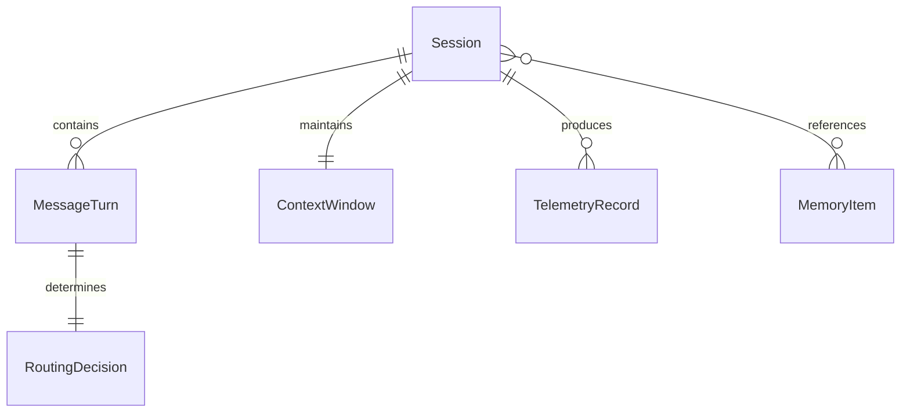
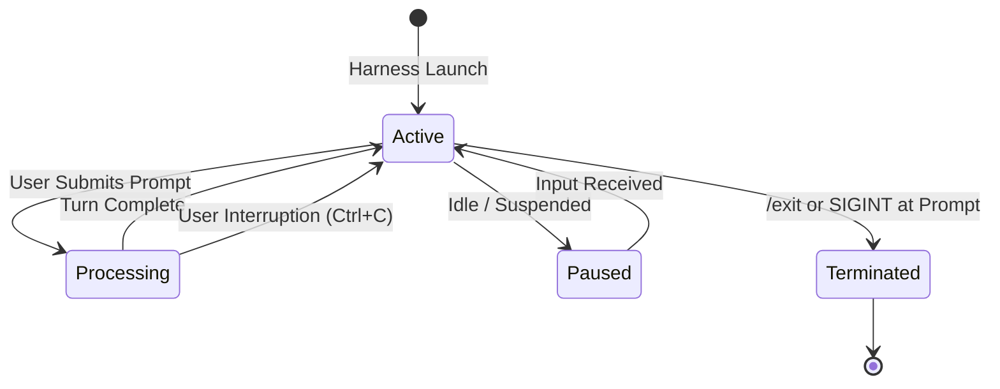
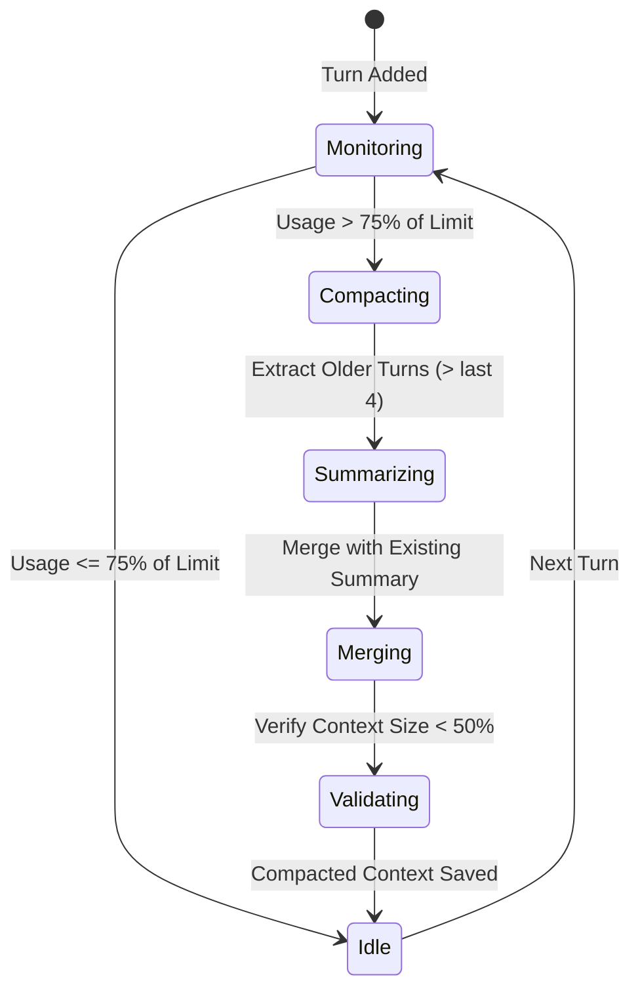

# Data Model: AI TUI Router Harness

**Date**: 2026-09-22  
**Feature**: [spec.md](spec.md)  
**Research Reference**: [research.md](research.md)

## Entity Relationship Overview

---

## Entities

### 1. Session

Represents an active or archived interactive conversation session within the harness.

| Field | Type | Description | Constraints |
|---|---|---|---|
| `id` | `string` (UUID v4) | Unique session identifier | Required, immutable |
| `title` | `string` | Human-readable title or generated topic summary | Default: "New Session" |
| `createdAt` | `string` (ISO 8601) | Timestamp when session was initiated | Required |
| `updatedAt` | `string` (ISO 8601) | Timestamp of latest activity | Required |
| `activeModelOverride` | `string \| null` | Optional manual model lock overriding auto-router | Optional |
| `totalInputTokens` | `number` | Cumulative input tokens spent in this session | >= 0 |
| `totalOutputTokens` | `number` | Cumulative output tokens generated in this session | >= 0 |
| `totalCostUsd` | `number` | Cumulative estimated cost in USD | >= 0.0 |
| `status` | `enum` | Lifecycle state (`active`, `paused`, `terminated`) | Default: `active` |

---

### 2. MessageTurn

Represents a single conversational exchange (user prompt and agent response pair).

| Field | Type | Description | Constraints |
|---|---|---|---|
| `id` | `string` (UUID v4) | Unique identifier for the turn | Required |
| `sessionId` | `string` (UUID v4) | Foreign key referencing parent `Session` | Required |
| `turnIndex` | `number` | 0-indexed sequence number in session | >= 0 |
| `role` | `enum` | Message sender role (`user`, `assistant`, `system`, `tool`) | Required |
| `content` | `string` | The text content of the message | Required |
| `timestamp` | `string` (ISO 8601) | Time message was created/completed | Required |
| `routingDecision` | `RoutingDecision \| null` | Associated routing decision (for assistant turns) | Null for user input |
| `tokenUsage` | `object` | `{ input: number, output: number, total: number }` | Non-negative integers |
| `durationMs` | `number` | End-to-end processing duration in milliseconds | >= 0 |

---

### 3. RoutingDecision

Represents the automated or manual model selection decision for an individual prompt turn.

| Field | Type | Description | Constraints |
|---|---|---|---|
| `id` | `string` (UUID v4) | Unique routing decision identifier | Required |
| `promptComplexityScore` | `number` | Normalized complexity score (0.0 to 1.0) | 0.0 <= score <= 1.0 |
| `selectedTier` | `enum` | Selected model tier (`free`, `budget`, `premium`) | Required |
| `selectedModel` | `string` | Model identifier (e.g. `gemini-2.5-flash`, `claude-3-5-sonnet`) | Required |
| `candidateModels` | `string[]` | List of models evaluated during decision | Non-empty |
| `reasoning` | `string` | Explanation of why this model was chosen | Required |
| `confidence` | `number` | Confidence score returned by router | 0.0 <= confidence <= 1.0 |
| `isFallback` | `boolean` | Indicates whether primary choice failed and fallback used | Default: `false` |
| `estimatedCostUsd` | `number` | Projected or calculated cost for this turn | >= 0.0 |

---

### 4. ContextWindow

Maintains the live token budget and manages compaction state for an active session.

| Field | Type | Description | Constraints |
|---|---|---|---|
| `sessionId` | `string` (UUID v4) | Unique reference to the active session | Required, 1-to-1 |
| `maxTokens` | `number` | Maximum token capacity of currently routed model | > 0 |
| `currentTokens` | `number` | Total token count currently loaded in context | >= 0 |
| `compactionThreshold` | `number` | Token ratio triggering automated compaction | Default: 0.75 (75%) |
| `uncompactedTurns` | `MessageTurn[]` | Recent turns kept uncompressed | Max 4-6 turns |
| `summaryBlock` | `string \| null` | Consolidated summary of older compacted turns | Null if no compaction |
| `compactionCount` | `number` | Total compaction passes performed in this session | >= 0 |

---

### 5. MemoryItem

Represents a persistent piece of knowledge, rule, or preference stored on local disk across sessions.

| Field | Type | Description | Constraints |
|---|---|---|---|
| `id` | `string` (UUID v4) | Unique memory item identifier | Required |
| `key` | `string` | Categorical key or subject identifier | 3-64 chars, kebab-case |
| `category` | `enum` | Classification (`preference`, `project-rule`, `entity-fact`) | Required |
| `content` | `string` | The text of the rule or persistent fact | Non-empty |
| `createdAt` | `string` (ISO 8601) | Timestamp of memory creation | Required |
| `updatedAt` | `string` (ISO 8601) | Timestamp of last modification | Required |
| `accessCount` | `number` | Frequency of retrieval across sessions | >= 0 |
| `tags` | `string[]` | Search and categorization tags | Array of strings |

---

### 6. TelemetryRecord

Structured record captured per prompt turn for observability, audit, and cost reporting.

| Field | Type | Description | Constraints |
|---|---|---|---|
| `id` | `string` (UUID v4) | Unique telemetry event ID | Required |
| `sessionId` | `string` (UUID v4) | Session reference | Required |
| `turnIndex` | `number` | Turn index | >= 0 |
| `timestamp` | `string` (ISO 8601) | Telemetry creation time | Required |
| `model` | `string` | Exact provider model identifier invoked | Required |
| `tier` | `enum` | `free` \| `budget` \| `premium` | Required |
| `inputTokens` | `number` | Prompt tokens counted | >= 0 |
| `outputTokens` | `number` | Response tokens counted | >= 0 |
| `decisionLatencyMs` | `number` | Router evaluation time in milliseconds | >= 0 |
| `generationLatencyMs` | `number` | Model inference duration in milliseconds | >= 0 |
| `costUsd` | `number` | Calculated cost in USD | >= 0.0 |
| `interrupted` | `boolean` | True if aborted by user cancellation | Default: `false` |

---

## State Transitions

### Session Lifecycle

### Context Compaction State Machine

