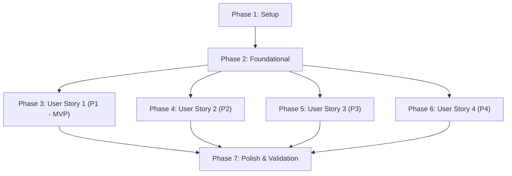

# Implementation Tasks: AI TUI Router Harness

**Feature**: [spec.md](spec.md) | **Plan**: [plan.md](plan.md) | **Branch**: `001-ai-tui-harness`

---

## Phase 1: Setup (Shared Infrastructure)

**Purpose**: Project initialization, build configuration, and testing infrastructure.

- [X] T001 Initialize Node.js TypeScript project with ESM configuration (`"type": "module"`), build/test scripts, and core dependencies (`ink`, `react`, `@vercel/ai`, `ai`, `zod`, `vitest`, `ink-testing-library`, `typescript`, `@types/react`, `@types/node`) in `package.json`
- [X] T002 [P] Configure TypeScript compiler options with strict type checking enabled (`strict: true`, `target: ES2022`, `module: NodeNext`, `moduleResolution: NodeNext`, `noEmit: true`) in `tsconfig.json`
- [X] T003 [P] Configure Vitest test runner with native ESM execution and code coverage reporting in `vitest.config.ts`
- [X] T004 [P] Configure ESLint and Prettier for code quality and style compliance in `eslint.config.js` and `.prettierrc`

---

## Phase 2: Foundational (Blocking Prerequisites)

**Purpose**: Shared domain types, model registry, telemetry logger, and deterministic mock providers.

**⚠️ CRITICAL**: No user story work can begin until this phase is complete.

- [X] T005 Implement shared domain types and Zod schemas (`Session` with `id: UUID v4 required immutable`, `status: active|paused|terminated`, `totalCostUsd: >=0.0`; `MessageTurn` with `role: user|assistant|system|tool`, `turnIndex: >=0`; `RoutingDecision` with `complexityScore: 0.0-1.0`, `selectedTier: free|budget|premium`; `MemoryItem`; `TelemetryRecord`) in `src/types/index.ts`
- [X] T006 [P] Implement candidate model definitions across `free`, `budget`, and `premium` tiers with pricing and context token limits in `src/router/modelRegistry.ts`
- [X] T007 [P] Implement structured NDJSON telemetry logger and error reporting utilities in `src/telemetry/logger.ts`
- [X] T008 [P] Implement offline deterministic mock router driver (`MockRouterProvider`) returning calibrated complexity scores and tier results in `tests/mocks/mockRouter.ts`
- [X] T009 [P] Implement offline deterministic mock agent execution driver (`MockEveAgent`) simulating token streams, tool events, and cancellation signals in `tests/mocks/mockEveAgent.ts`

**Checkpoint**: Core types and mock drivers ready — user story implementation can now proceed.

---

## Phase 3: User Story 1 - Interactive Terminal Prompting with Cost-Optimized Routing (Priority: P1) 🎯 MVP

**Goal**: Users can launch the interactive TUI, enter prompts, have queries evaluated and routed to the best free/low-cost model via `typesafe-ai/jev` (with heuristic fallback), receive streaming answers in the terminal, and abort immediately via Ctrl+C.

**Independent Test**: Run `pnpm test tests/unit/router.test.ts tests/contract/cli.test.ts` and launch `pnpm start` to verify prompt submission, model tier status indicator, and streaming response output.

### Tests for User Story 1 ⚠️

> **NOTE: Write these tests FIRST, ensure they FAIL before implementation.**

- [X] T010 [P] [US1] Write unit tests for dynamic model router (`typesafe-ai/jev` scoring, candidate tier matching, and fallback escalation) in `tests/unit/router.test.ts`
- [X] T011 [P] [US1] Write contract tests for Eve Agent Bridge event streaming, tool events, and AbortSignal cancellation in `tests/contract/agentBridge.test.ts`
- [X] T012 [P] [US1] Write contract tests for CLI arguments (`--model`, `--tier`, `--dry-run`) and process exit codes in `tests/contract/cli.test.ts`

### Implementation for User Story 1

- [X] T013 [P] [US1] Implement `IModelRouter` routing engine integrating `typesafe-ai/jev` decision model via Vercel AI SDK in `src/router/jevRouter.ts`
- [X] T014 [P] [US1] Implement deterministic heuristic fallback router for offline execution and unconfigured API keys in `src/router/heuristicRouter.ts`
- [X] T015 [US1] Implement router factory assembling `jevRouter` with `heuristicRouter` fallback and candidate registry in `src/router/index.ts`
- [X] T016 [US1] Implement `IEveAgentBridge` decoupling Vercel Eve runtime from UI, dispatching typed lifecycle events (`step_start`, `token_stream`, `step_finish`, `cancelled`) with AbortSignal in `src/agent/bridge.ts`
- [X] T017 [P] [US1] Implement TUI multiline prompt input component with command history and Enter submission in `src/tui/components/PromptInput.tsx`
- [X] T018 [P] [US1] Implement TUI streaming response component rendering markdown text progressively in `src/tui/components/MessageStream.tsx`
- [X] T019 [P] [US1] Implement TUI status bar displaying active model, routing tier, and agent state in `src/tui/components/StatusBar.tsx`
- [X] T020 [P] [US1] Implement raw-mode keybindings and signal listener for immediate `Ctrl+C` / `Esc` cancellation in `src/tui/hooks/useKeybindings.ts`
- [X] T021 [US1] Implement root Ink TUI application orchestrating prompt submission, router evaluation, agent streaming, and cancellation in `src/tui/App.tsx`
- [X] T022 [US1] Implement CLI entry point parsing command arguments (`--model`, `--tier`, `--dry-run`) and launching Ink render loop in `src/cli/index.ts` and `src/cli/flags.ts`

**Checkpoint**: User Story 1 is fully functional as a standalone MVP harness.

---

## Phase 4: User Story 2 - Automated Context Window Tracking and Compaction (Priority: P2)

**Goal**: Continuous token tracking against model limits with automated compaction at 75% threshold, keeping the 4 most recent turns uncompressed and summarizing older turns.

**Independent Test**: Run `pnpm test tests/unit/contextManager.test.ts` and execute multi-turn conversation exceeding threshold to verify automated compaction without context loss.

### Tests for User Story 2 ⚠️

- [X] T023 [P] [US2] Write unit tests for token counting, 75% compaction threshold detection, and uncompacted turn preservation in `tests/unit/contextManager.test.ts`
- [X] T024 [P] [US2] Write unit tests for token estimation across model families in `tests/unit/tokenCounter.test.ts`

### Implementation for User Story 2

- [X] T025 [P] [US2] Implement lightweight token counter and context headroom estimator in `src/memory/tokenCounter.ts`
- [X] T026 [US2] Implement `IContextManager` managing uncompacted turns, triggering compaction at 0.75 threshold, and retaining recent 4 turns in `src/memory/contextManager.ts`
- [X] T027 [US2] Integrate context manager into `src/agent/bridge.ts` to supply compacted history into Eve prompt context
- [X] T028 [US2] Add `/context` and `/compact` slash command handlers and status bar token percentage indicator in `src/tui/App.tsx` and `src/tui/components/StatusBar.tsx`

**Checkpoint**: User Stories 1 and 2 work independently and in combination.

---

## Phase 5: User Story 3 - Persistent Knowledge and Preference Memory (Priority: P3)

**Goal**: Persistent memory store on local disk with atomic write operations, allowing users to save, inspect, and delete cross-session preferences and project rules.

**Independent Test**: Run `pnpm test tests/unit/persistentStore.test.ts` and verify `/memory add` writes to `.jev/memory.json` loaded upon restart.

### Tests for User Story 3 ⚠️

- [X] T029 [P] [US3] Write unit tests for atomic file writes, memory CRUD operations, and category filtering in `tests/unit/persistentStore.test.ts`

### Implementation for User Story 3

- [X] T030 [US3] Implement `IPersistentMemoryStore` with atomic file replacement (`write temp -> fsync -> rename`) storing records in `.jev/memory.json` or `~/.config/jev-router-harness/memory.json` in `src/memory/persistentStore.ts`
- [X] T031 [US3] Implement memory injection hook loading relevant persistent memories into agent context on session init in `src/agent/bridge.ts`
- [X] T032 [P] [US3] Implement TUI memory management modal component for viewing, adding, and deleting stored memories in `src/tui/components/MemoryModal.tsx`
- [X] T033 [US3] Implement `/memory add`, `/memory list`, and `/memory del` slash commands in `src/tui/App.tsx`

**Checkpoint**: User Stories 1, 2, and 3 are functional.

---

## Phase 6: User Story 4 - Session Telemetry and Cost Transparency (Priority: P4)

**Goal**: Per-turn and session-level telemetry showing model used, tokens in/out, latency, estimated cost, and cost savings vs premium models.

**Independent Test**: Run `pnpm test tests/unit/telemetry.test.ts` and run `/telemetry summary` to verify metrics accuracy.

### Tests for User Story 4 ⚠️

- [X] T034 [P] [US4] Write unit tests for cost calculation across model tiers and savings calculations in `tests/unit/telemetry.test.ts`

### Implementation for User Story 4

- [X] T035 [P] [US4] Implement cost calculator computing per-turn and cumulative session cost from token counts and provider pricing in `src/telemetry/costCalculator.ts`
- [X] T036 [US4] Record `TelemetryRecord` after each turn in `src/telemetry/logger.ts` and update session totals in `src/tui/App.tsx`
- [X] T037 [P] [US4] Implement TUI telemetry dashboard overlay component showing cost breakdown and savings vs premium tier in `src/tui/components/TelemetryView.tsx`
- [X] T038 [US4] Implement `/telemetry` slash command displaying turn logs and session summary in `src/tui/App.tsx`

**Checkpoint**: All user stories complete and functional.

---

## Phase 7: Polish & Cross-Cutting Concerns

**Purpose**: Dynamic terminal resizing, default Eve agent configuration, end-to-end quickstart validation, and test coverage verification.

- [X] T039 [P] Implement dynamic terminal resize hook (`useTerminalResize`) updating Ink layout geometry without line doubling in `src/tui/hooks/useTerminalResize.ts`
- [X] T040 [P] Implement default filesystem-first Eve agent configuration (`instructions.md`, `agent.ts`, `tools/`) in `src/agent/defaultAgent/`
- [X] T041 Execute end-to-end quickstart validation scenarios from `specs/001-ai-tui-harness/quickstart.md`
- [X] T042 [P] Verify code coverage meets ≥ 85% requirement across `src/router/` and `src/memory/` and verify clean build (`tsc --noEmit`)

---

## Dependencies & Execution Order

### Phase Dependencies

- **Setup (Phase 1)**: No dependencies — executes immediately.
- **Foundational (Phase 2)**: Depends on Phase 1 completion — BLOCKS all user story phases.
- **User Story 1 (Phase 3)**: Depends on Phase 2 — delivers MVP.
- **User Story 2 (Phase 4)**: Depends on Phase 2; integrates with US1 bridge.
- **User Story 3 (Phase 5)**: Depends on Phase 2; integrates with US1 agent context.
- **User Story 4 (Phase 6)**: Depends on Phase 2; instruments US1 turns.
- **Polish (Phase 7)**: Depends on completion of all desired user story phases.

### User Story Dependencies

---

## Parallel Opportunities

### Within Phase 1 (Setup)
- `T002`, `T003`, `T004` can run concurrently in parallel.

### Within Phase 2 (Foundational)
- `T006`, `T007`, `T008`, `T009` can run concurrently in parallel after `T005`.

### Within User Story 1 (Phase 3)
- Tests `T010`, `T011`, `T012` can run concurrently.
- Router components `T013`, `T014` can run in parallel with TUI components `T017`, `T018`, `T019`, `T020`.

### Cross-Story Parallelism
- Once Phase 2 (Foundational) completes, US1, US2, US3, and US4 can be implemented in parallel by different developers or subagents.

---

## Implementation Strategy

### MVP First (User Story 1 Only)
1. Complete Phase 1 (Setup: T001–T004).
2. Complete Phase 2 (Foundational: T005–T009).
3. Complete Phase 3 (User Story 1: T010–T022).
4. **Validate MVP**: Launch `pnpm start`, submit a prompt, verify routing and streaming output.

### Incremental Delivery
1. Add User Story 2 (Context Compaction: T023–T028) → Test prolonged conversations.
2. Add User Story 3 (Persistent Memory: T029–T033) → Test cross-session preferences.
3. Add User Story 4 (Telemetry & Cost Dashboard: T034–T038) → Test cost calculation and audit.
4. Execute Polish (T039–T042) and full quickstart validation suite.
